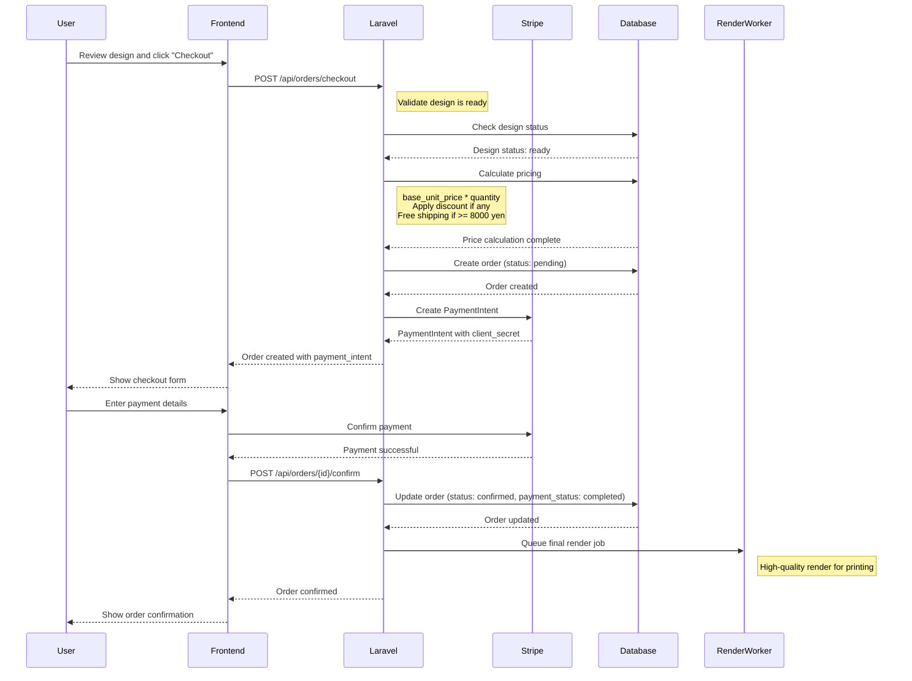
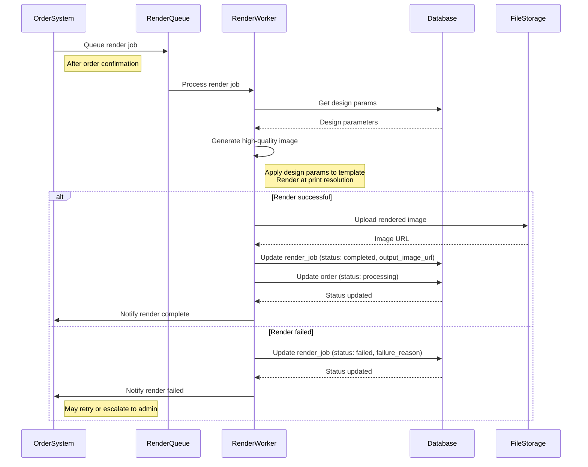
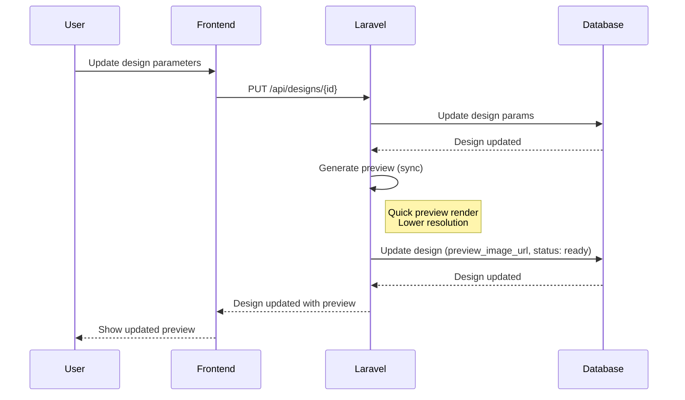
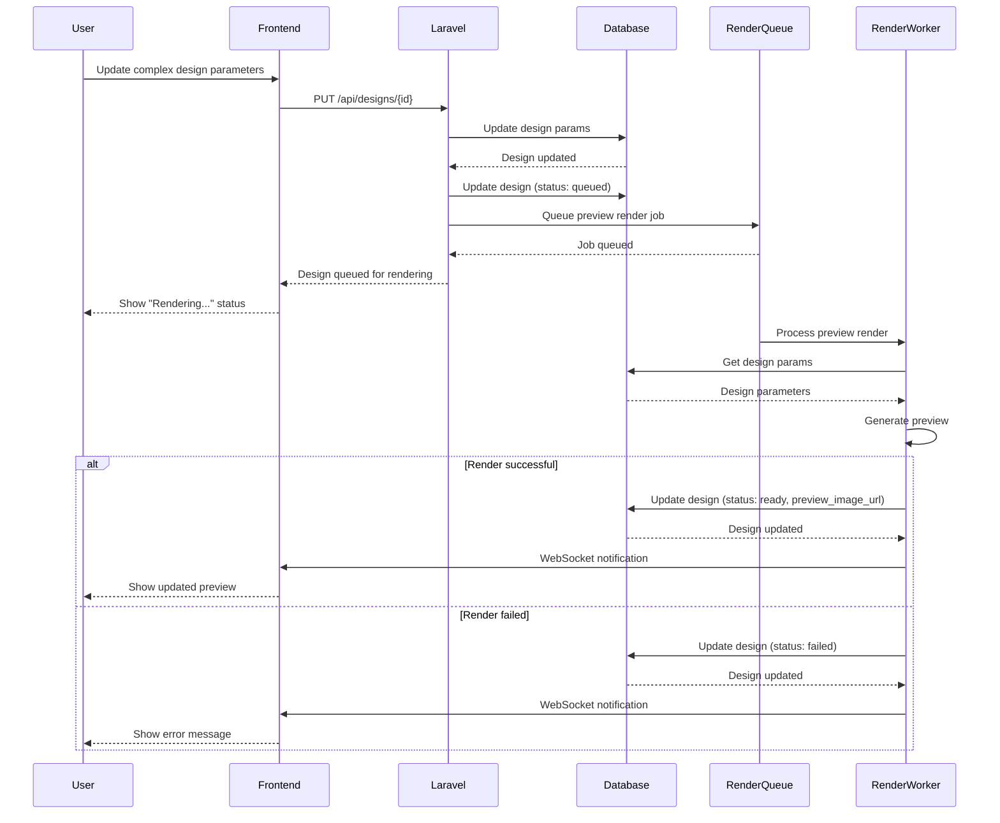
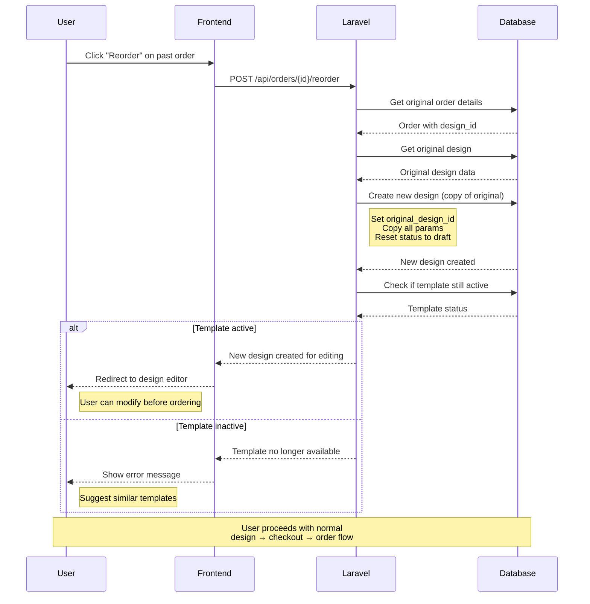
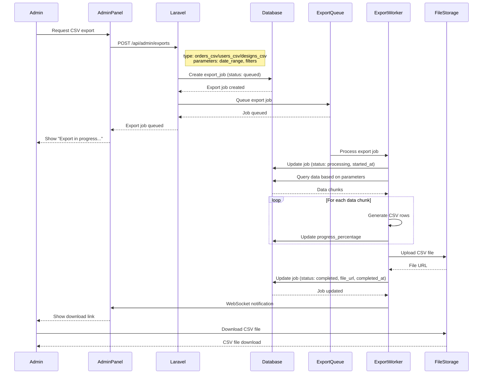
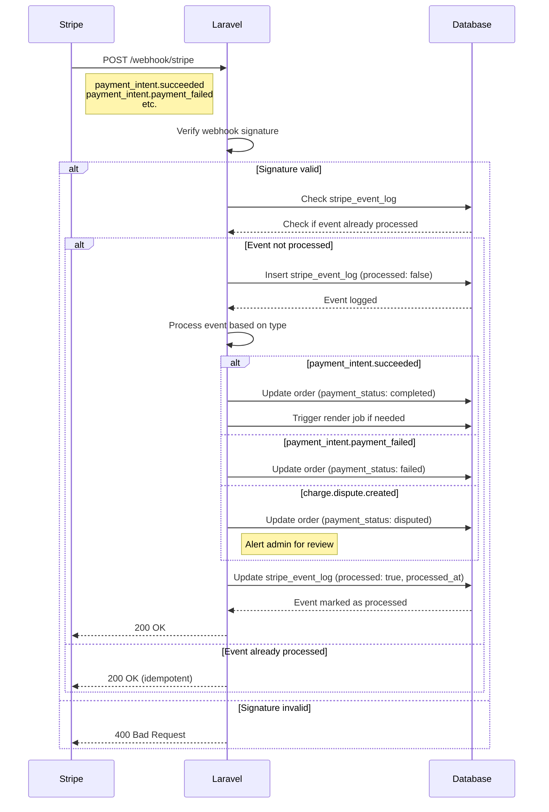

# Sequence Diagrams - petStarShop EC Site

This document contains sequence diagrams for the main workflows in the petStarShop EC site.

## 1. Checkout Process

## 2. Final Render Workflow

## 3. Preview Sync/Async Operations

### 3.1 Synchronous Preview (for simple designs)

### 3.2 Asynchronous Preview (for complex designs)

## 4. Reorder Functionality

## 5. CSV Export Job Workflow

## 6. Stripe Webhook Processing

## Notes

- All sequence diagrams assume proper error handling and logging
- WebSocket notifications are optional and can be replaced with polling
- File storage can be AWS S3, Google Cloud Storage, or local storage
- Render workers should implement retry logic with exponential backoff
- All monetary amounts are stored as integers (yen cents) to avoid floating point issues
- Rate limiting should be applied to all public-facing endpoints