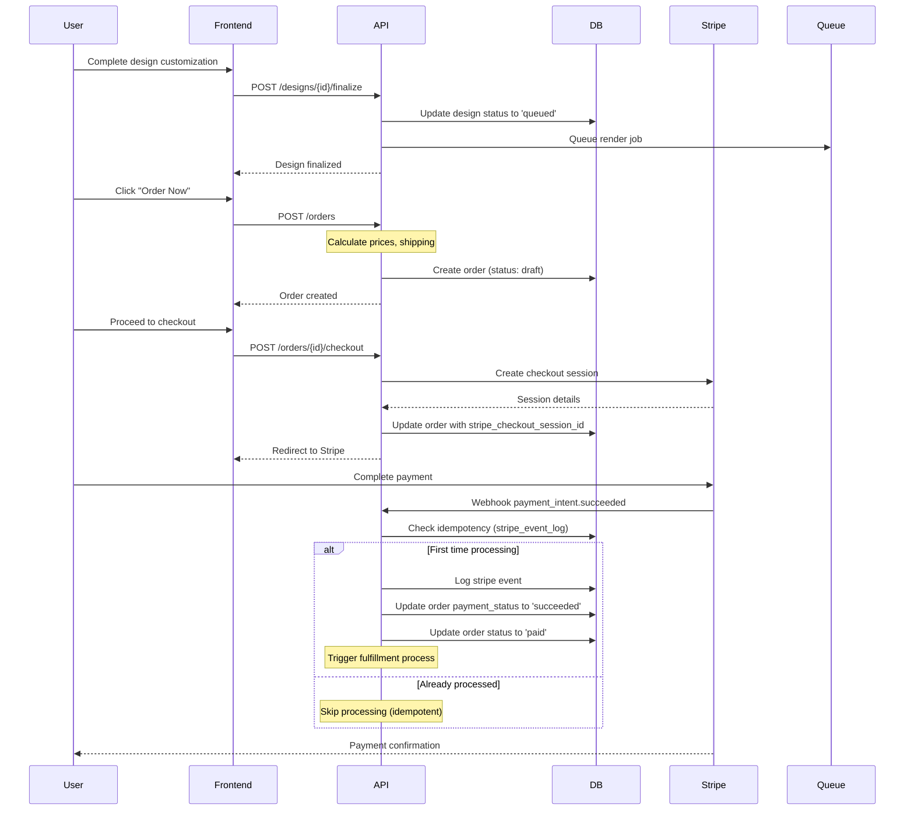
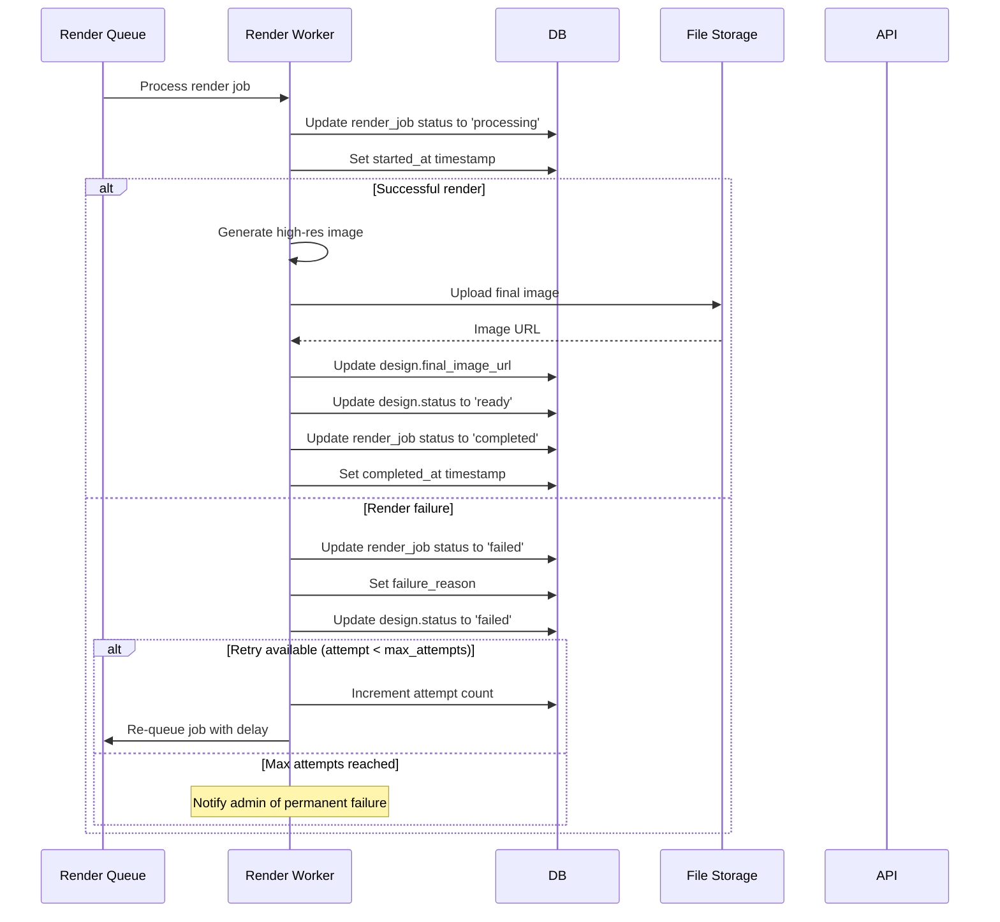
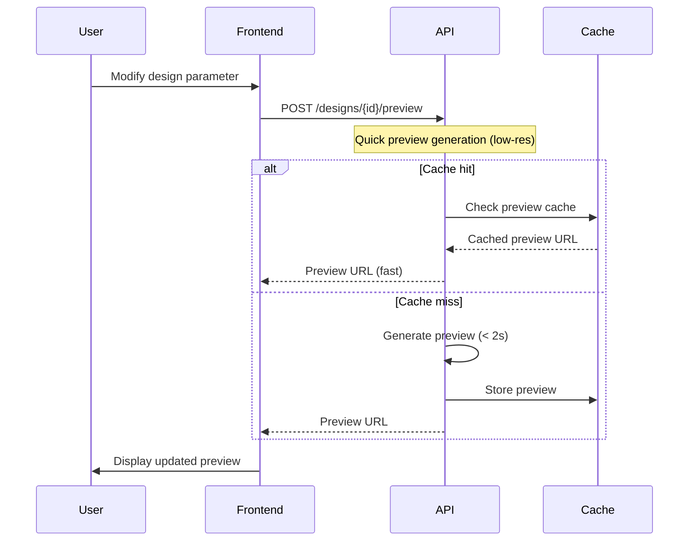
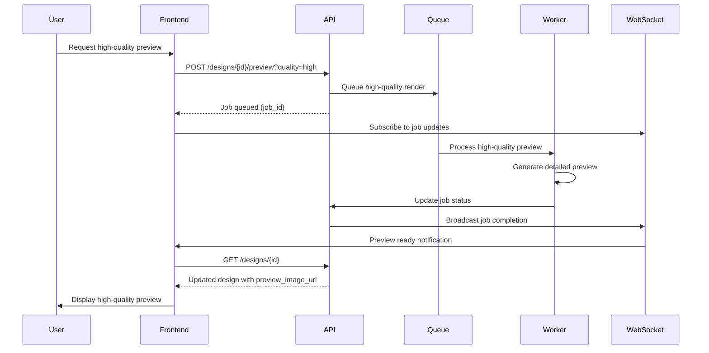
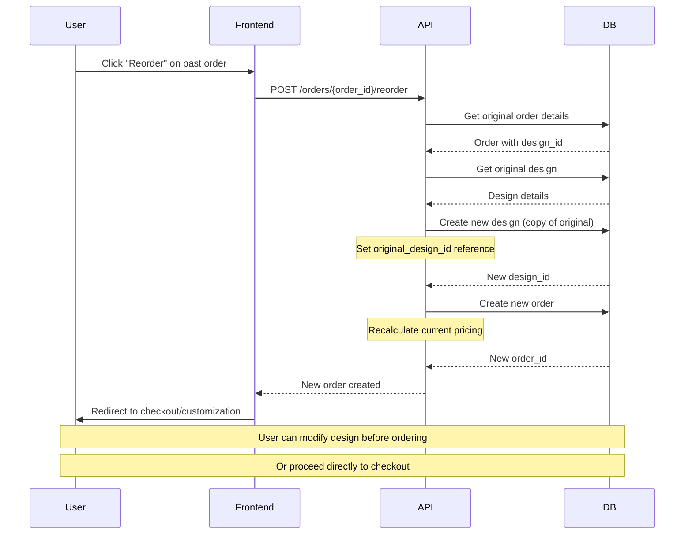
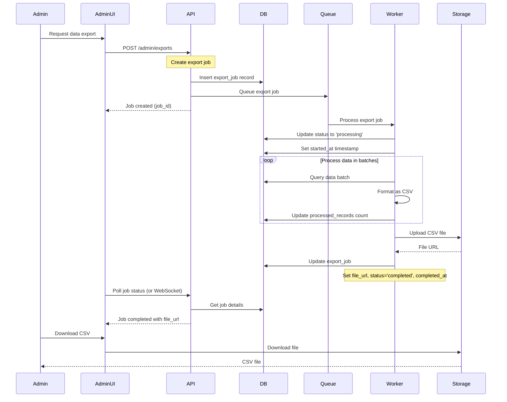
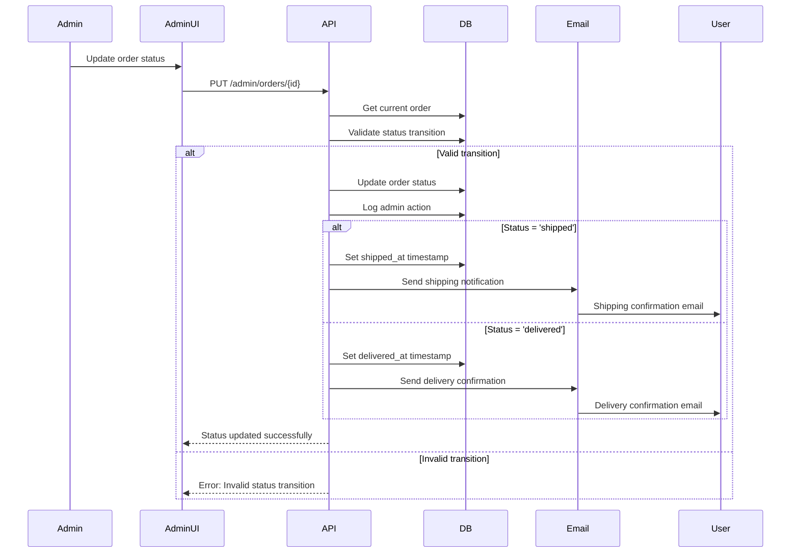

# petStarShop Sequence Diagrams

This document contains Mermaid sequence diagrams for the main workflows in the petStarShop EC site.

## 1. Checkout Flow

## 2. Final Render Flow

## 3. Preview Sync/Async Flow

### Synchronous Preview (Real-time)

### Asynchronous Preview (High Quality)

## 4. Reorder Flow

## 5. CSV Export Job Flow

## 6. Order Status Update Flow

## Notes

### Error Handling
- All API endpoints include proper error responses with status codes
- Database constraints prevent invalid data states
- Retry mechanisms for temporary failures (network, external services)
- Idempotency keys for critical operations (payments, renders)

### Performance Considerations
- Design parameter changes use CRC32 hash for quick comparison
- JSONB indexes for efficient querying of flexible data
- Background job processing for time-consuming operations
- Caching for frequently accessed previews

### Security
- Admin actions are logged for audit trail
- Rate limiting counters for API protection
- Stripe webhook verification for payment security
- UUID primary keys to prevent enumeration attacks