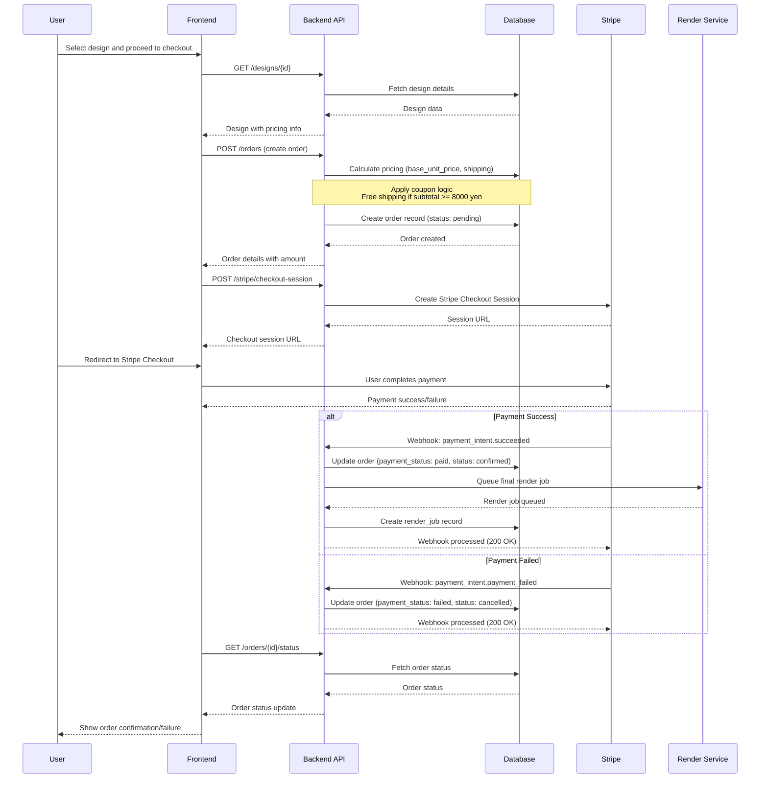
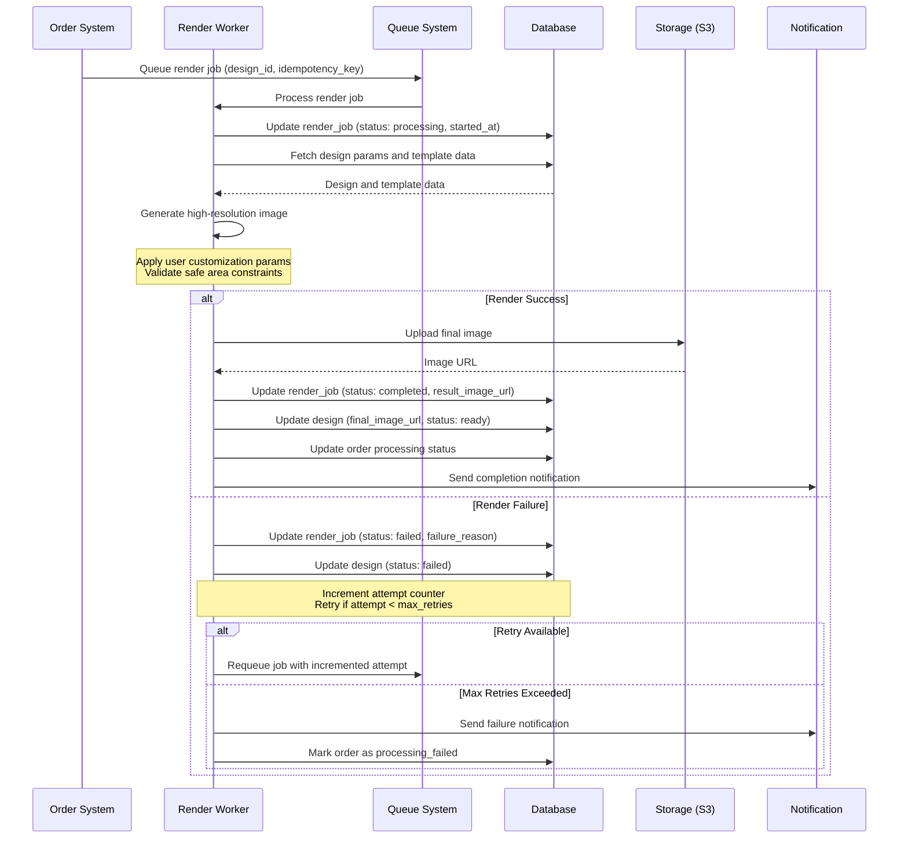
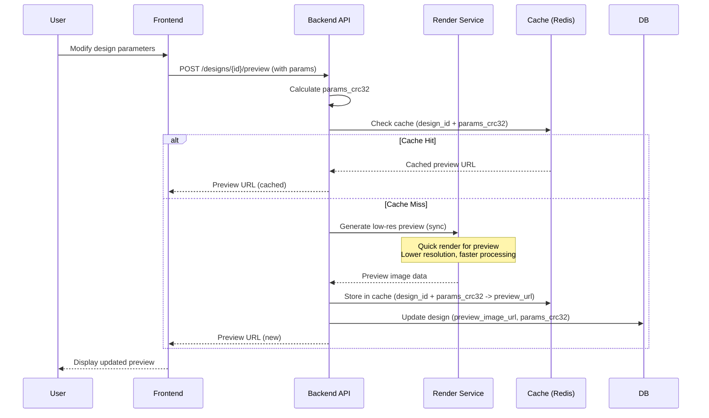
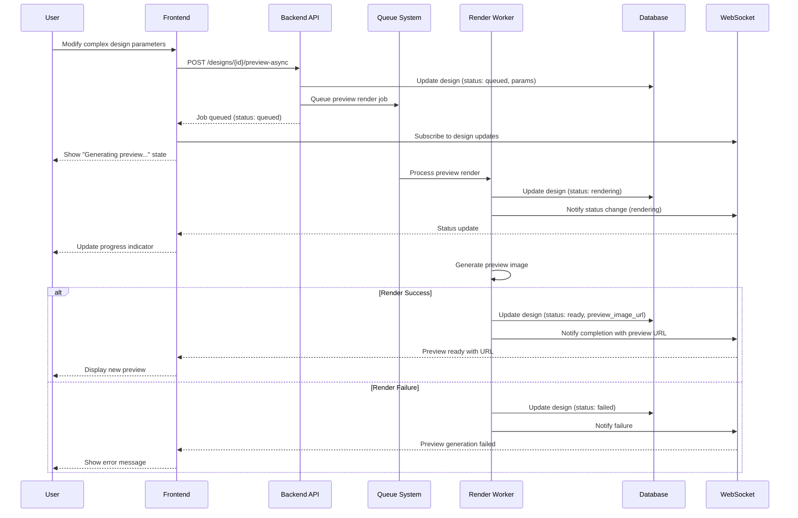
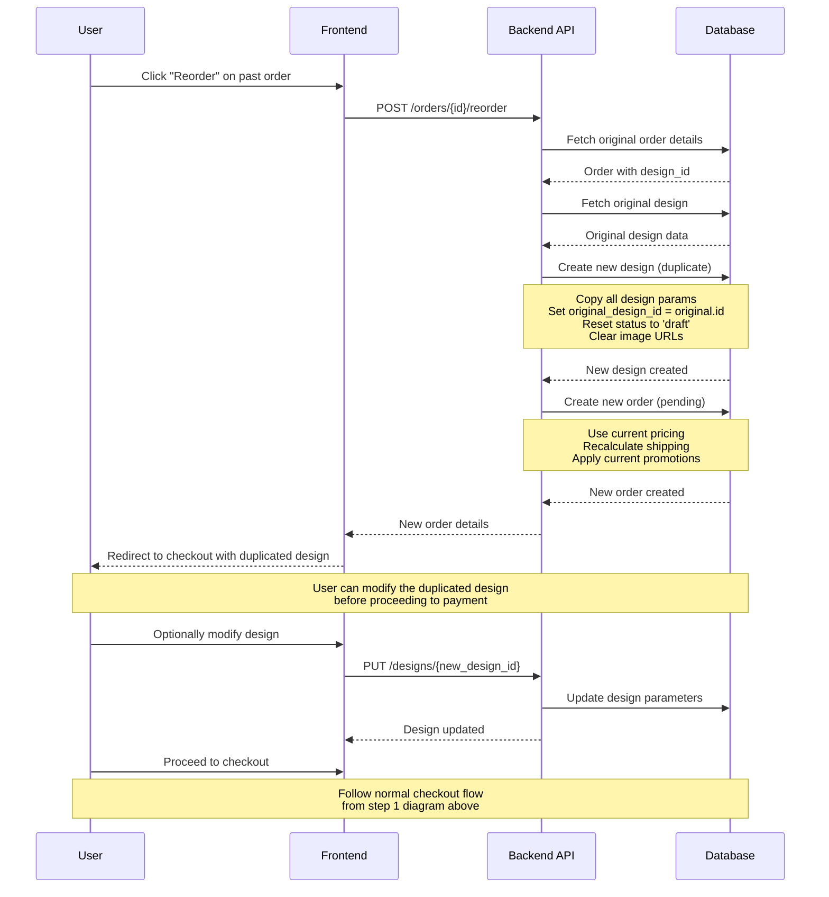

# Sequence Diagrams - petStarShop EC Site

This document contains the main sequence diagrams for the petStarShop EC site core flows.

## 1. Checkout Flow



## 2. Final Render Process



## 3. Preview Generation (Sync/Async)

### 3.1 Synchronous Preview (for immediate feedback)



### 3.2 Asynchronous Preview (for complex designs)



## 4. Reorder Functionality



## Notes

### Design Status Flow
- `draft` → `queued` → `rendering` → `ready` | `failed`
- Reordered designs start as `draft` to allow modifications

### Order Status Flow
- `pending` → `confirmed` → `processing` → `shipped` → `delivered`
- Cancellation possible: `pending|confirmed` → `cancelled`
- Refund possible: `confirmed|processing|shipped|delivered` → `refunded`

### Render Job Retry Logic
- Maximum 3 attempts per render job
- Exponential backoff: 1min, 5min, 15min
- Different failure_reason categories for debugging:
  - `template_error`: Template data issues
  - `params_invalid`: User parameter validation failed
  - `render_timeout`: Rendering process timeout
  - `storage_error`: File upload/storage issues
  - `system_error`: Unexpected system errors

### Idempotency
- All render jobs use idempotency_key (design_id + params_crc32 + attempt)
- Stripe webhooks deduplicated using stripe_event_id
- Preview cache based on design_id + params_crc32

### Free Shipping Logic
```
subtotal_after_discount = subtotal - discount_total
shipping_fee = (subtotal_after_discount >= 8000) ? 0 : standard_shipping_fee
amount = subtotal_after_discount + shipping_fee
```